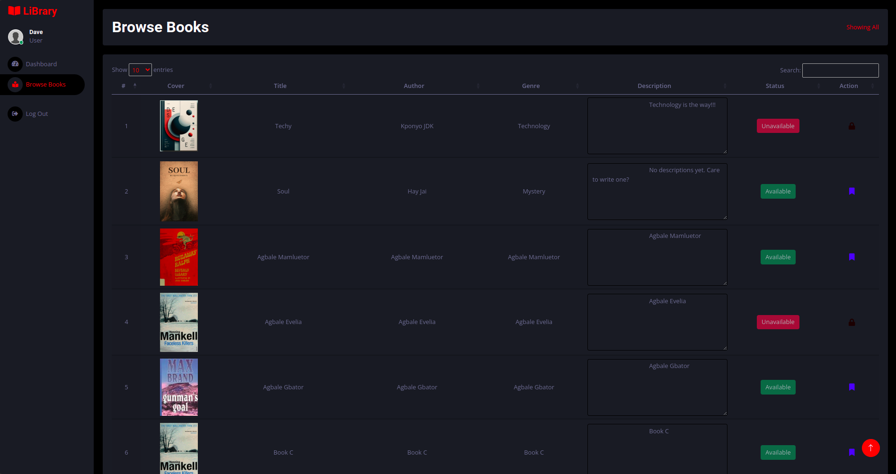

# Library Management System



## Table of Contents
- [Introduction](#introduction)
- [Project Structure](#project-structure)
- [Installation](#installation)
- [Configuration](#configuration)
- [Usage](#usage)
- [Dependencies](#dependencies)
- [License](#license)

## Introduction

The **Library Management System** is a web application designed to help manage books and user interactions in a library setting. It allows administrators to manage book records, users to borrow and return books, and provides a simple interface for library operations.

### Features
- **User Management**: Allows users to register, login; browse, borrow, and search books and also view their personal loan history.
- **Book Management**: Admins can add, edit, remove, list, and view all transactions and reports in the library.
- **Authentication**: User login and authentication to protect certain routes.
- **File Upload**: Admins can upload book covers 
## Project Structure

The project is structured as follows:

```bash
library-management-system/
├── config/                      # Configuration files
│   ├── db.js                    # Database connection configuration
├── controllers/                 # Business logic for handling routes
│   ├── bookController.js        # Logic for book-related operations
│   └── userController.js        # Logic for user-related operations
├── middleware/                  # Middlewares for various functionalities
│   ├── authMiddleware.js        # Middleware for authentication
│   ├── uploadMiddleware.js      # Middleware for file uploads
├── models/                      # Data models (Database schemas)
│   ├── bookModel.js             # Book model (defines book schema)
│   └── userModel.js             # User model (defines user schema)
├── node_modules/                # Node.js dependencies
├── public/                      # Publicly accessible files (e.g., CSS, images)
│   ├── css/                     # Stylesheets
│   ├── img/                     # Image files
│   └── js/                      # JavaScript files
│   ├── lib/                     # Additional libraries
│   ├── scss/                    # SCSS files
│   ├── uploads/                 # Uploaded files (e.g., book covers)
├── routes/                      # Application routes
│   ├── bookRoutes.js            # Routes for book management
│   └── userRoutes.js            # Routes for user management
├── views/                       # EJS templates for views
│   ├── books/                   # Book-related views
│   │   ├── add.ejs              # Add new book view
│   │   ├── edit.ejs             # Edit book view
│   │   └── list.ejs             # List books view
│   │   └── manage.ejs           # Manage book view
│   ├── layouts/                 # Layouts for pages
│   │   └── main.ejs             # Main layout
│   ├── partials/                # Reusable partial templates
│   │   └── footer.ejs           # Footer template
│   │   └── header.ejs           # Header template
│   │   └── sidebar.ejs          # Sidebar template
│   └── users/                   # User-related views
│       └── ldashboard.ejs       # User dashboard view
│       ├── login.ejs            # User login view
│       └── udashboard.ejs       # Admin dashboard view
│       ├── register.ejs         # User registration view
│   └── 404.ejs                  # 404 page view (Page not found)
├── .env                          # Environment variables
├── .gitignore                    # Git ignore file
├── app.js                         # Main application file (entry point)
├── db-schema.sql                 # SQL schema for setting up the database
├── package-lock.json             # Lock file for package versions
├── package.json                  # Project dependencies and metadata
├── README.md                     # Project documentation

```

## Installation

To install and set up the Library Management System, follow these steps:

1. **Clone the repository**:

   ```bash
   git clone https://github.com/your-username/library-management-system.git
   cd library-management-system


## Install dependencies:

Use npm to install the required dependencies.

```bash
npm install
```

## Set up the environment

- Create a `.env` file in the root directory.
- Add the following environment variables:

  ```plaintext
  PORT=3000
  DB_HOST=your-host
  DB_USER=your-user
  DB_PASSWORD=your-password
  DB_NAME=library
  SESSION_SECRET=your-session-secret

- Ensure the database is configured as per db-schema.sql (provided in the project).


## Run the application

Start the application using the following command:

```bash
npm start
``` 

- The app will be accessible at http://localhost:3000 (or another port if configured).


## Configuration

- **Database**: The application uses MySQL as the database. You need to set up the database schema using the `db-schema.sql` file. This will create the necessary tables for users and books.
  
- **Authentication**: The authentication mechanism uses `express-session` for managing user sessions. Make sure to configure a secure `SESSION_SECRET` in your `.env` file.

- **File Uploads**: File uploads are handled using `multer`, and uploaded files are stored in the `public/uploads` directory.

## Usage

Once the application is running, users can access various features:

- **User Registration and Login**: Users can create an account, log in, and view their dashboard.
- **Book Management**: Admin users can add, edit, view, and delete books.
- **Admin Dashboard**: The admin can view and manage books and transactions.

### Accessing Pages:

- **Login Page**: `/login`
- **Registration Page**: `/register`
- **Books List**: `/`
- **Admin Dashboard**: `/ldashboard`
- **User Dashboard**: `/udashboard`
- **404 Error Page**: If a route does not exist, it will show a 404 error page.

## Dependencies

This project uses the following dependencies:

- **bcryptjs**: For password hashing and security.
- **body-parser**: To parse incoming request bodies.
- **dotenv**: To manage environment variables.
- **ejs**: For templating and rendering dynamic views.
- **express**: Web framework for building the app.
- **express-ejs-layouts**: For easy management of EJS layouts.
- **express-session**: For managing user sessions.
- **express-validator**: For form validation.
- **human-friendly-date**: For formatting dates.
- **multer**: For handling file uploads.
- **mysql2**: MySQL database connector for Node.js.

To install the dependencies, run:

```bash
npm install
